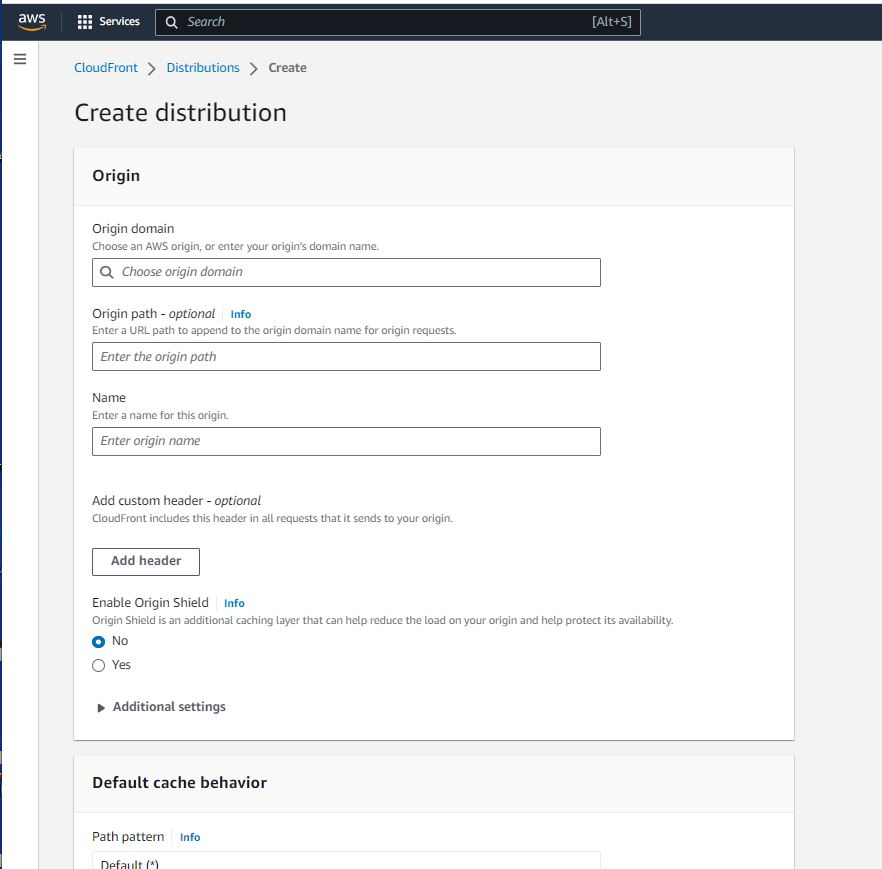

# S3 Bucket CDN configuration

1. Open the CloudFront console.
2. Choose Create Distribution.
3. Under Origin, for Origin domain, choose your S3 bucket's REST API endpoint from the dropdown list. Or, enter your S3 bucket's website endpoint. For more information, see Key differences between a website endpoint and a REST API endpoint.
4. Under Default cache behavior, Viewer, for Viewer Protocol Policy, select HTTP and HTTPS or Redirect HTTP to HTTPS.

5. If you don't use an Alternate domain name (CNAME) with CloudFront, then choose Create Distribution to complete the process. If you use a CNAME, then follow these additional steps before you create the distribution:

 - For Alternate Domain Names (CNAMEs), choose Add item, and then enter your alternate domain name.
 - For Custom SSL Certificate, choose the custom SSL certificate from the dropdown list that covers your CNAME to assign it to the distribution.
Note: For more information on installing a certificate, see How do I configure my CloudFront distribution to use an SSL/TLS certificate?
- Choose Create distribution.
Note: After you choose Create distribution, it might take 20 or more minutes for your distribution to deploy.  
&nbsp;

