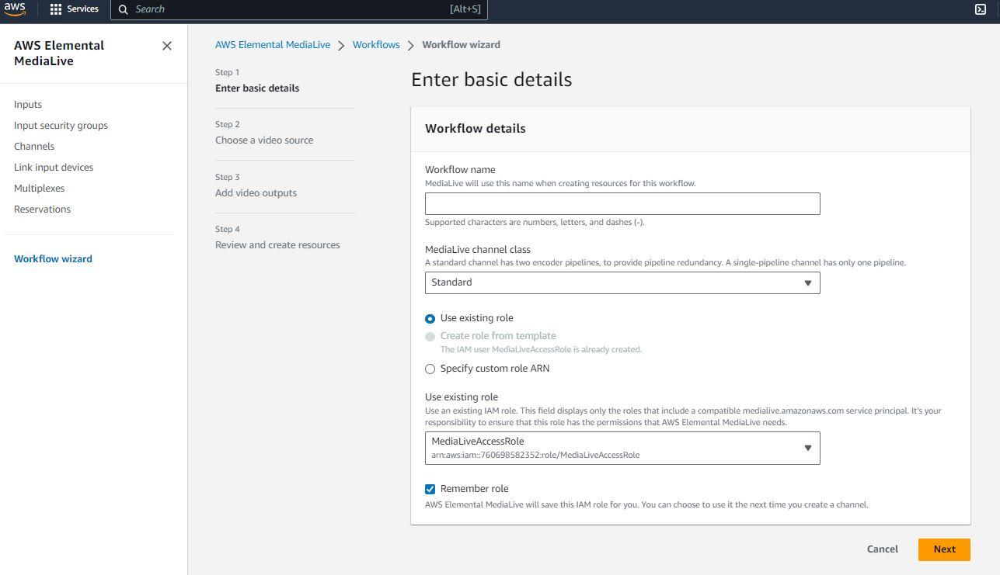
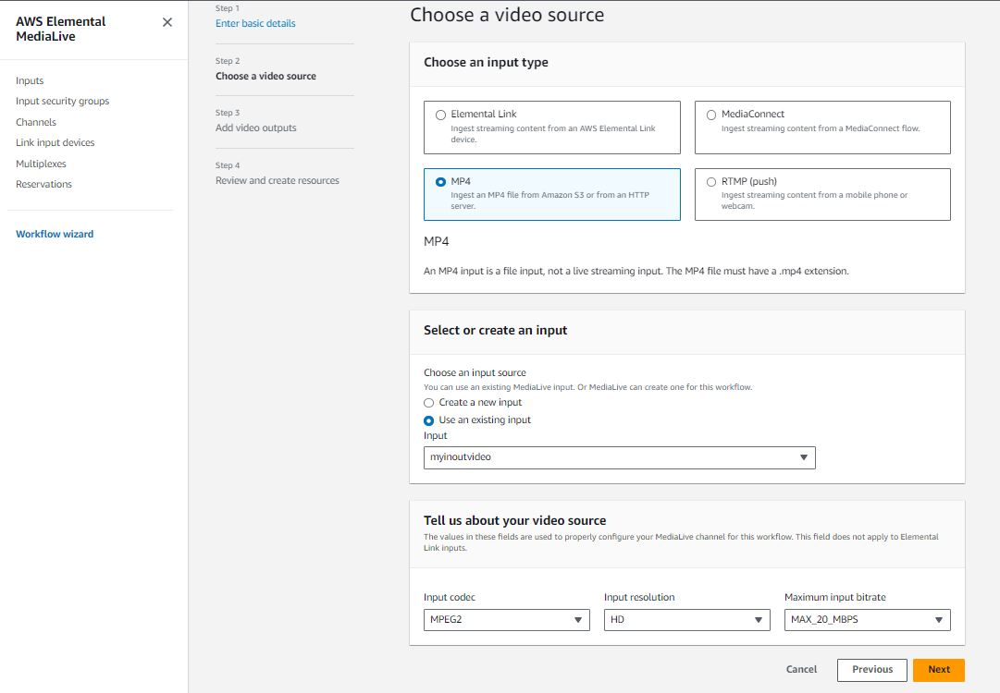
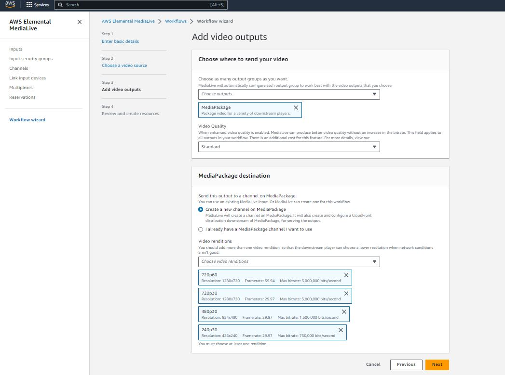

 # MediaLive AWS

 ## AWS Elemental MediaLive is a live video processing service offered by Amazon Web Services (AWS). It allows you to create and manage live video workflows for broadcasting video content to viewers over the internet

### Workflow Wizard
1. Locate, or search for, “MediaLive” and open it.
2. At the top left of the service screen is a menu, indicated by three lines, click the menu.
3. Then navigate to Workflow Wizard.
4. Within the Workflow Wizard, click on the Create workflow button to start setup.

### Basic details
1. Enter a Workflow name.
2. SINGLE_PIPELINE from the MediaLive channel class.(to save money)
3. Select the Use existing role and select medialive.

  

### Video source

1. Choose an input type (MP4 this case)
2. Create a new media live input `Create a new input`
3. Tell us about your video source use input code `MPEG2` and lest the rest equal

### Video outputs
Select the configuration as it show in the image
1. Choose output `Mediapackage`
2. Video quality `standard`
3. MediaPackage destination  `Create a new channel on MediaPackage`
4. Video renditions we recommend you keep at least quality just for testing purposes

  

### Review and create resources
***Please make sure that all configurations are correct*** 

# IMPORTANT
## Streaming live signals is avery expensive service we recommend that ALWAYS stop the MediaLive Workflow as soon as you finish to avoid incurring in not expected expenses. 

The per hour cost for a live standard channel with two HD inputs (using input switching) and producing 5 outputs with advanced audio in the US East (N. Virginia) Region would be $3.942:

| Input                                    |
| ---------------------------------------- |
| 1080p HD, HEVC, 20Mbps = $0.588 per hour |
| 1080p HD, HEVC, 20Mbps = $0.588 per hour |

| AVC Outputs |
| ---------------------------------------- |
| 1080p HD, 5Mbps 30fps = $0.702 per hour |
| 720p HD, 2Mbps, 30fps, = $0.702 per hour |
| 576p SD, 1.2Mbps, 30fps, = $0.354 per hour| 
| 432p SD, 0.8Mbps, 30fps = $0.354 per hour |
| 288p SD, 0.5Mbps, 30fps = $0.354 per hour |

| Add-On Functionality |
| ---------------------------------------- |
| Advanced audio = $0.300 per hour |

## Total
$0.588 + $0.588 + $0.702 + $0.702 + $0.354 + $0.354 + 0.354 + $0.300 = $3.942 per hour
Or $0.0657 per minute with a minimum charge of $0.657 (10 minutes) 
-> $0.657*240 min = $157.68 day.  
This can increase in proportions of how many viewers you have since the cost of CDN are separate