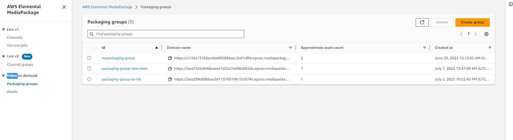
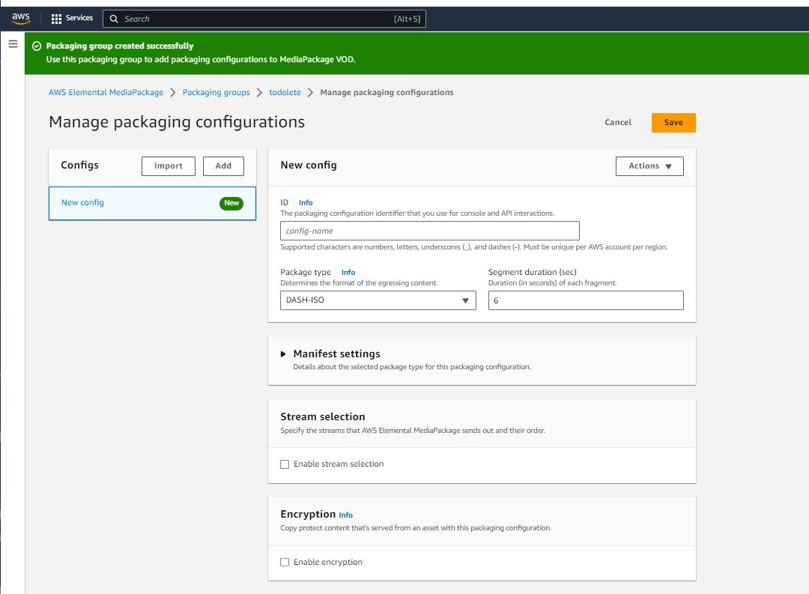
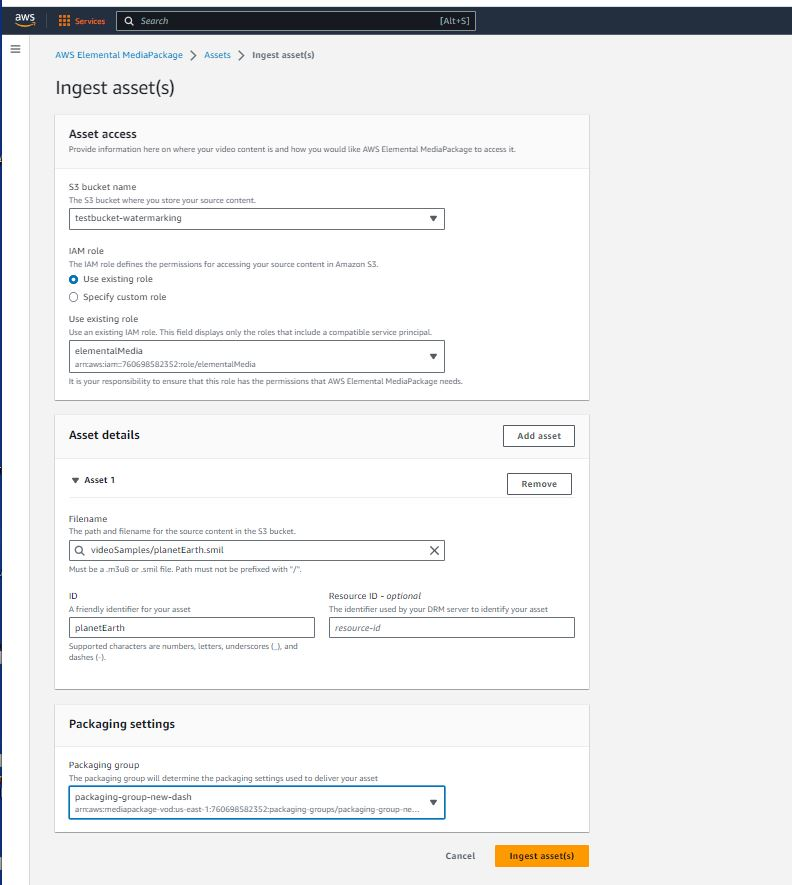

# AWS VOD ingestion 
### Refers to the process of uploading or transferring video content to Amazon Web Services (AWS) for further processing and storage. VOD stands for "Video on Demand," which is a model that allows users to access video content whenever they want, as opposed to live streaming.
&nbsp;

## IAM policy
- [x]  Create an IAM policy for MediaPackage VOD
 1. Sign in to the AWS Management Console and open the IAM console at https://console.aws.amazon.com/iam/.
 2. In the navigation pane on the left, choose Policies.
 3. If this is your first time choosing Policies, the Welcome to Managed Policies page appears. Choose Get Started.
 4. At the top of the page, choose Create policy.
 5. In the Policy editor section, choose the JSON option and insert the contenct of `IAM-policy-vod.json` file
 6. Select `next` and type  ` Policy name` 
 7. Select `Create policy`

## S3
- [x] Store mp4 videos inside S3 buckect:
  * Include smilfile configuration for the videos for more information about it check examples smilfiles we use for this project in [smilfiles](https://github.com/FAU-Project-Watermarl/Watermark-CPRT-AWS/tree/master/smilFiles)

## Packaging group
- [x] Create packaging group 
 1. On the `Packaging groups` page, choose `Create group`.
 2. Type `ID` to describe the group 
 3. Choose `Create`.

## Packaging configuration
- [x] Create a packaging configuration
 1. On the `Packaging groups` page, choose the group.
 2. On the details page for the packaging group, under `Packaging configuration`s choose `Manage configurations`.
 3. For `ID`, enter a name that describes the configuration, such as hls_highlights. 
 4. Select `package type` in our case **DASH-ISO**
 5. Select `Segment duration` in seconds Ex.  6 
 6. Also you can configure other `Manifest settings`
 7. Keep the defaults for the remaining fields, and then choose `Save`.

## Ingest Asset
- [x] To create an asset
1. On `Assets` click on `Ingest assets`
2. Select `S3 bucket name` where the mp4 is stored
3. Select *Use existing role* in `IAM role`  and select role create previouly from the file `IAM-policy-vod.json`
4. On `Asset details` select the smil filename and its full path of the video we want to ingest
5. Create `ID` ofr the video 
6. in `Packaging settings` select the previously created `packaging group`
7. Finally, click on `Ingest assets(s)`
